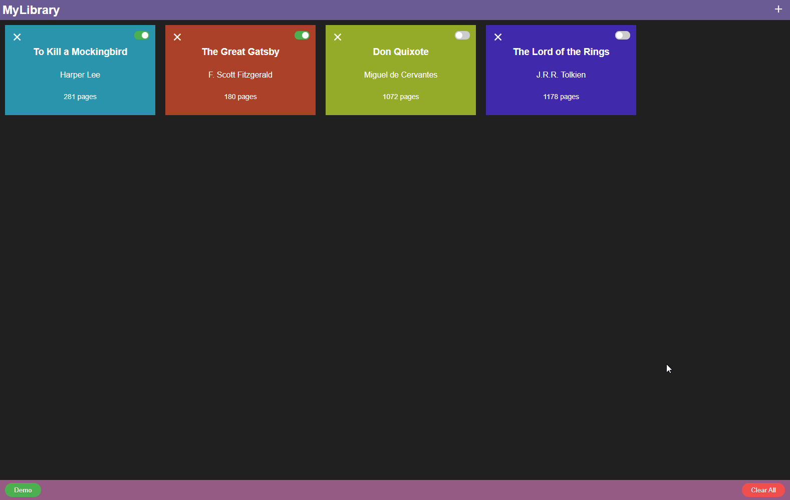

# JS Library

### [Live Demo](https://danmenjivar.github.io/js-library/)

#### 📝 Description
 
A virtual library program to store the books you've read and those you've been meaning to read. A project from [the Odin Project Curriculum](https://www.theodinproject.com/paths/full-stack-javascript/courses/javascript/lessons/library). 

#### 💡 Features
* Every book is saved to localStorage
* You can add/remove books.
* Update the read status for each book

#### 🛠️ Built with
* HTML
* Sass/CSS
* JavaScript
